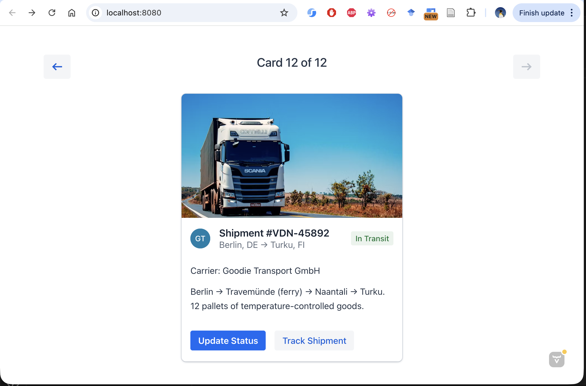

# Vaadin Application

Simple card demo app that shows different ways to configure a Vaadin Card component. See the [Vaadin Card documentation](https://vaadin.com/docs/latest/components/card) for details.

Browse through cards by clicking on the arrow buttons or using keyboard's arrow keys.


## Requirements

- Java 21
- Maven

## Run

```bash
./mvnw
```

Open <http://localhost:8080>
